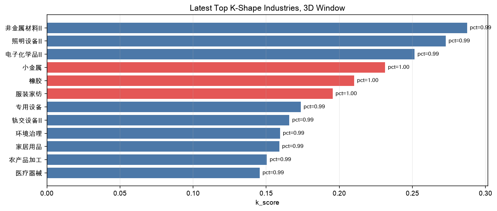
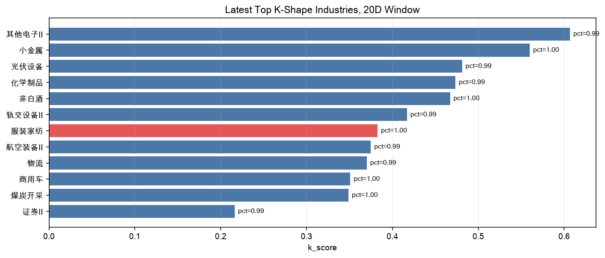
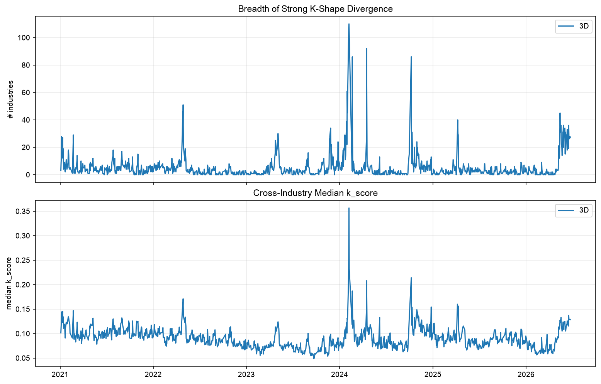
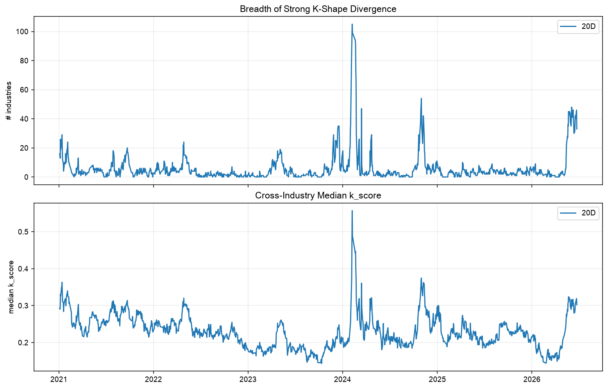

# 同行业 K 形分化结果报告

本报告基于三组结果整理：

| 样本区间 | 收益窗口 | 说明 |
| --- | ---: | --- |
| 2021-01-04 至 2026-06-23 | 3 个交易日 | 长样本短窗口结果 |
| 2021-01-04 至 2026-06-23 | 20 个交易日 | 长样本月度窗口结果 |


最新截面日期为 **2026-06-23**。以下“最新”均指该交易日。

## 1. 指标口径

对每个交易日、每个申万二级行业、每个收益窗口 `W`：

1. 计算个股 `W` 日对数收益。
2. 用行业内股票的 `FREE_MV` 加权收益作为行业收益。
3. 计算个股相对行业的超额收益。
4. 将行业内股票按超额收益排序，取前 20% 作为 top leg，后 20% 作为 bottom leg。
5. 定义：

```text
k_spread = top_mean_excess - bottom_mean_excess
k_score  = k_spread if top_mean_excess > 0 and bottom_mean_excess < 0 else 0
```

以及

```text
k_zscore为同一股票的k_score按时序进行标准化得到的结果
k_pct为同一股票的k_score在时序上的百分排位
```

报告中的“强 K 形行业”沿用汇总脚本口径：

```text
k_score > 0 且 k_pct >= 0.9 且 k_zscore >= 2
```

这表示行业内部已经形成正负两端分叉，并且分化幅度处在自身历史高位。

## 2. 核心结论

1. 最新截面上，同行业 K 形分化明显存在。3 日窗口有 **27** 个强 K 形行业，20 日窗口有 **33** 个强 K 形行业。
2. 近期分化广度明显高于长期常态。2021-2026 长样本中，3 日窗口强 K 行业数的日均值为 **5.20** 个、中位数为 **3** 个；20 日窗口日均值为 **5.89** 个、中位数为 **3** 个。最新截面分别达到 27 和 33 个，属于明显偏高状态。
3. 3 日窗口更刻画短线冲击，最新头部行业集中在小金属、橡胶、服装家纺、非金属材料、照明设备等；20 日窗口更刻画月度级别结构性分化，最新头部行业集中在服装家纺、小金属、非白酒、商用车、煤炭开采等。
4. 跨窗口重合行业有限。最新 3 日和 20 日窗口 top 10 中仅 **小金属、服装家纺、轨交设备Ⅱ** 同时出现，说明短期分化与月度分化的行业结构并不完全相同。
5. 2024 年 2 月是样本内最极端的分化阶段。3 日窗口在 2024-02-07 达到 **110** 个强 K 行业，20 日窗口在同日达到 **105** 个强 K 行业。2026 年 5-6 月也出现明显抬升，是近期需要重点跟踪的阶段。

## 3. 最新截面：3 日窗口

长样本 3 日窗口在 2026-06-23 的强 K 形行业数为 **27** 个。头部行业如下：

| rank | industry | 股票数 | k_score | k_pct | k_zscore | top leg 超额 | bottom leg 超额 | 行业收益 |
| ---: | --- | ---: | ---: | ---: | ---: | ---: | ---: | ---: |
| 1 | 小金属 | 26 | 0.2314 | 1.000 | 3.82 | 10.54% | -12.60% | 4.15% |
| 2 | 橡胶 | 22 | 0.2102 | 1.000 | 3.24 | 9.50% | -11.51% | 3.09% |
| 3 | 服装家纺 | 53 | 0.1955 | 1.000 | 3.93 | 10.75% | -8.80% | 2.05% |
| 4 | 非金属材料Ⅱ | 12 | 0.2874 | 0.992 | 3.62 | 13.96% | -14.78% | 5.57% |
| 5 | 照明设备Ⅱ | 14 | 0.2728 | 0.992 | 3.77 | 17.28% | -9.99% | -2.11% |
| 6 | 电子化学品Ⅱ | 35 | 0.2515 | 0.992 | 3.14 | 10.34% | -14.82% | 3.58% |
| 7 | 专用设备 | 189 | 0.1736 | 0.992 | 2.54 | 8.78% | -8.59% | 0.26% |
| 8 | 家居用品 | 69 | 0.1589 | 0.992 | 2.47 | 8.64% | -7.25% | -0.00% |
| 9 | 农产品加工 | 22 | 0.1505 | 0.992 | 2.64 | 8.76% | -6.28% | -3.47% |
| 10 | 轨交设备Ⅱ | 31 | 0.1658 | 0.988 | 3.41 | 10.60% | -5.99% | -0.73% |

最新 3 日窗口的首位行业是 **小金属**。该行业 top leg 平均超额收益为 10.54%，bottom leg 平均超额收益为 -12.60%，行业内部首尾差达到 23.14%。从股票腿看：

- Top leg：`002167.SZ` 24.43%、`000962.SZ` 11.48%、`000657.SZ` 9.37%、`002428.SZ` 7.83%、`002842.SZ` 6.75%。
- Bottom leg：`002149.SZ` -24.18%、`001257.SZ` -11.41%、`002738.SZ` -10.95%、`002182.SZ` -8.32%、`001280.SZ` -8.12%。



## 4. 最新截面：20 日窗口

长样本 20 日窗口在 2026-06-23 的强 K 形行业数为 **33** 个。头部行业如下：

| rank | industry | 股票数 | k_score | k_pct | k_zscore | top leg 超额 | bottom leg 超额 | 行业收益 |
| ---: | --- | ---: | ---: | ---: | ---: | ---: | ---: | ---: |
| 1 | 服装家纺 | 53 | 0.3827 | 1.000 | 2.84 | 13.88% | -24.39% | -1.14% |
| 2 | 小金属 | 25 | 0.5598 | 0.996 | 3.81 | 19.67% | -36.31% | 19.32% |
| 3 | 非白酒 | 12 | 0.4671 | 0.996 | 4.60 | 24.40% | -22.31% | -12.98% |
| 4 | 商用车 | 13 | 0.3510 | 0.996 | 3.38 | 19.83% | -15.27% | -18.79% |
| 5 | 煤炭开采 | 30 | 0.3487 | 0.996 | 3.30 | 22.21% | -12.66% | -3.68% |
| 6 | 其他电子Ⅱ | 33 | 0.6067 | 0.992 | 3.28 | 24.17% | -36.50% | 15.93% |
| 7 | 化学制品 | 177 | 0.4734 | 0.992 | 3.58 | 21.53% | -25.80% | 5.79% |
| 8 | 轨交设备Ⅱ | 31 | 0.4169 | 0.992 | 3.55 | 20.65% | -21.03% | -1.35% |
| 9 | 航空装备Ⅱ | 47 | 0.3747 | 0.992 | 2.79 | 24.53% | -12.93% | -12.99% |
| 10 | 证券Ⅱ | 50 | 0.2162 | 0.992 | 3.20 | 8.89% | -12.73% | 8.37% |

最新 20 日窗口的首位行业是 **服装家纺**。该行业 top leg 平均超额收益为 13.88%，bottom leg 平均超额收益为 -24.39%，行业内部首尾差达到 38.27%。从股票腿看：

- Top leg：`002762.SZ` 36.80%、`603608.SH` 33.05%、`300005.SZ` 24.22%、`603001.SH` 19.82%、`600630.SH` 17.23%。
- Bottom leg：`300952.SZ` -40.65%、`601566.SH` -31.35%、`002875.SZ` -27.34%、`002612.SZ` -23.87%、`003041.SZ` -23.71%。



## 5. 历史分化广度

强 K 行业数衡量的是“分化有多广”。长样本统计如下：

| 窗口 | 最新强 K 行业数 | 日均值 | 中位数 | 75% 分位 | 90% 分位 | 样本最大值 |
| ---: | ---: | ---: | ---: | ---: | ---: | --- |
| 3 日 | 27 | 5.20 | 3 | 5 | 10 | 2024-02-07：110 |
| 20 日 | 33 | 5.89 | 3 | 6 | 12 | 2024-02-07：105 |

按年份看，2024 年和 2026 年的分化广度显著高于其他年份：

| 年份 | 3 日窗口日均强 K 行业数 | 20 日窗口日均强 K 行业数 |
| ---: | ---: | ---: |
| 2021 | 5.13 | 5.61 |
| 2022 | 3.79 | 3.27 |
| 2023 | 4.32 | 5.08 |
| 2024 | 8.42 | 9.81 |
| 2025 | 2.87 | 3.16 |
| 2026 | 8.42 | 11.48 |

月度层面，样本内分化最强的月份集中在 2024 年 2 月和 2026 年 5-6 月：

| 窗口 | 月份 | 月均强 K 行业数 |
| ---: | --- | ---: |
| 3 日 | 2024-02 | 44.13 |
| 3 日 | 2026-06 | 25.81 |
| 3 日 | 2026-05 | 23.00 |
| 20 日 | 2024-02 | 57.47 |
| 20 日 | 2026-06 | 39.81 |
| 20 日 | 2026-05 | 26.29 |





## 6. 行业稳定性观察

从“进入每日 top 10 的频率”看，3 日窗口和 20 日窗口的高频行业有所不同。

长样本 3 日窗口中，进入每日 top 10 频率较高的行业包括：

| industry | 进入 top 10 次数 |
| --- | ---: |
| 装修装饰Ⅱ | 168 |
| 影视院线 | 164 |
| 油服工程 | 162 |
| 其他电子Ⅱ | 159 |
| 通信服务 | 157 |
| 电视广播Ⅱ | 156 |
| 元件 | 155 |
| 医药商业 | 152 |

长样本 20 日窗口中，进入每日 top 10 频率较高的行业包括：

| industry | 进入 top 10 次数 |
| --- | ---: |
| 环保设备Ⅱ | 198 |
| 游戏Ⅱ | 183 |
| 通信服务 | 181 |
| 装修装饰Ⅱ | 177 |
| 玻璃玻纤 | 171 |
| 动物保健Ⅱ | 169 |
| 工程咨询服务Ⅱ | 166 |
| 汽车服务 | 160 |

这说明 K 形分化并不是只出现在少数固定行业里，而是会随阶段性主题、行业景气和个股事件扩散。若用于跟踪，可以同时关注两个维度：

- 截面强度：当前哪些行业 `k_score`、`k_pct`、`k_zscore` 最高。
- 历史稳定性：哪些行业反复进入 top 10 或反复满足强 K 条件。
