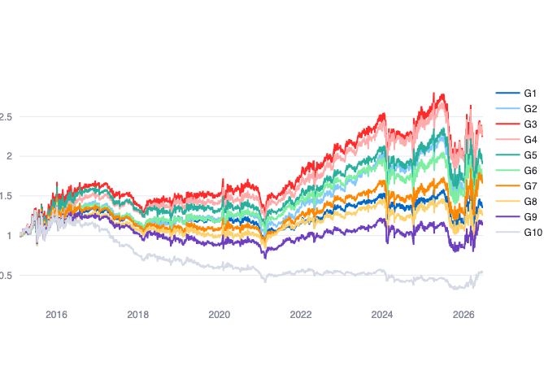
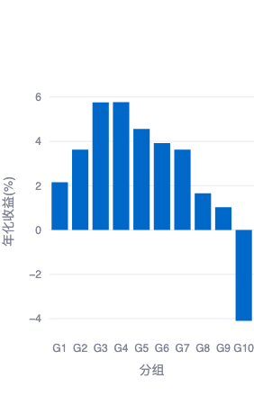
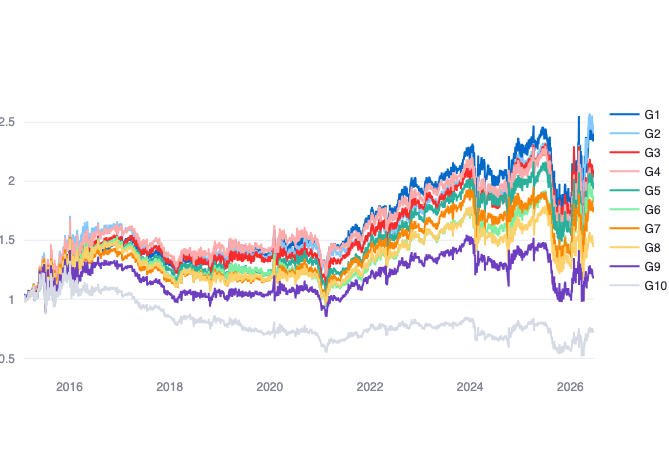
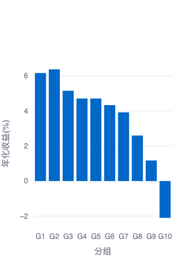
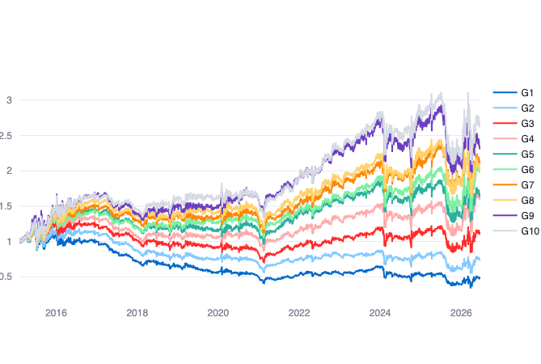
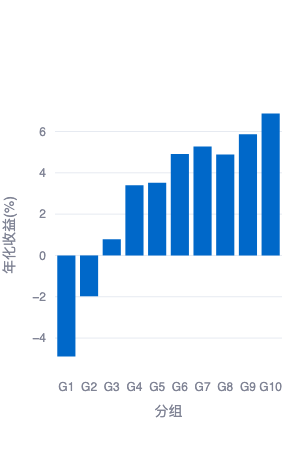

# 研报复现：《长江证券20260705》

完整标题：*高频因子（二十）：收益来源基础的因子挖掘方法论三——时间点划分因子*

## 数据说明

样本：全市场分频数据`dfs://data_m-stock_m`

时间窗口：20150105-20250722

## Heuristic Example

三种时间跨度下的收益率因子分别定义为：

- 收益率-整体：过去 20 个交易日所有数据的对数收益率求和，计算结果在日内横截面上做标准化；
- 收益率-时间段：过去 20 个交易日中，提取每日分频下每笔成交量(`volume / num_trades`)在前 20%的数据，该数据的对数收益率求和，计算结果在日内横截面上做标准化；
- 收益率-时间点：过去 20 个交易日中，提取每日分频率下每笔成交量最大的数据，该数据的对数收益率求和，计算结果在日内横截面上做标准化。

下图报告了三个因子在20150105-20250722窗口内的累积rankIC：

- 三者整体趋势相似，累积IC的排序分别为：时间段>整体>时间点；
- overall 和 point 几乎不相关（Pearson 约 0.06）；period_top20 与另外两个都呈中等正相关（Pearson 约 0.5）；
- 时间段因子同时包含了整体因子与时间点因子的信息，在信息与噪声之间取得了较好的平衡，效果最好。

## 时间点局部因子
（注：以下三个因子的回测结果均为中性化处理后的结果。）
### 价格-高点-振幅因子
假设股票价格序列为

$$
p_{i,d,t},
$$

表示股票 $i$ 在第 $d$ 天第 $t$ 个分频时点的价格（取 `close`）。以分频股票数据为例，价格-高点-振幅因子的具体计算方法为：

1. 对价格序列做滚动平均，窗口为 `window`，得到平滑价格。价格只取日内的价格。

2. 对每只股票，在每天内取平滑价格的最大值对应的时点，记为

$$
t^{\ast}=\arg\max_t \bar p_{i,d,t}.
$$

3. 对于长度分别为 $L,R$ 的左右窗口，对区间

$$
[t^{\ast} - L, t^{\ast} + R]
$$

内的每根K线振幅求平均（等权），其中振幅定义为

$$
a_{i,d,t}=\frac{\mathrm{high}_{i,d,t}-\mathrm{low}_{i,d,t}}{\mathrm{close}_{i,d,t}}.
$$

若窗口位于开盘/收盘附近，例如 $t^{\ast} - L \lt 1$，则将区间左端点取为开盘时点，右端点同理。

4. 计算结果在每日横截面内做标准化。

#### 回测结果

| 净值曲线 | 年度收益 |
| --- | --- |
|  |  |

| year | RankIC(%) | RankICIR | 多头超额收益(%) | 多头信息比 | 多头超额最大回撤(%) | 空头超额收益(%) | 空头信息比 | 空头超额最大回撤(%) | 多头年化收益(%) | 多头年化波动率(%) | 多头最大回撤(%) |
| --- | --- | --- | --- | --- | --- | --- | --- | --- | --- | --- | --- |
| all | -5.12 | -2.82 | 2.28 | -0.08 | -58.69 | 4.33 | -0.13 | -55.24 | 8.02 | 26.01 | -60.22 |
| 2025 | -4.15 | -1.55 | -33.49 | -0.78 | -34.06 | 39.38 | 0.6 | -15.99 | 15.94 | 14.05 | -16.51 |
| 2024 | -6.63 | -3.16 | -1.66 | -0.2 | -30.59 | 19.71 | -0.01 | -32.81 | 9.35 | 38.93 | -29.89 |
| 2023 | -5.06 | -4.04 | 9.09 | 0.31 | -7.83 | -2.29 | -0.24 | -17.05 | 1.09 | 15.11 | -13.97 |
| 2022 | -5.55 | -3.31 | 12.36 | 0.38 | -11.07 | 1.98 | -0.13 | -15.89 | -7.68 | 21.62 | -29.73 |
| 2021 | -3.97 | -2.28 | 10.32 | 0.25 | -14.24 | -6.12 | -0.34 | -29.57 | 17.63 | 14.62 | -11.3 |
| 2020 | -3.55 | -1.67 | -13.96 | -0.46 | -27.03 | 16.19 | 0.06 | -18.69 | 9.53 | 25.49 | -17.91 |
| 2019 | -6.21 | -2.39 | -7.05 | -0.32 | -11.08 | 23.4 | 0.41 | -16.72 | 23.32 | 20.61 | -18.91 |
| 2018 | -6.38 | -5.35 | 6.14 | 0.1 | -15.71 | 3.41 | -0.1 | -17.8 | -23.4 | 23.28 | -35.46 |
| 2017 | -5.92 | -5.14 | -13.62 | -0.72 | -16.15 | 33.65 | 1.8 | -5.11 | -11.46 | 15.8 | -17.81 |
| 2016 | -5.45 | -2.5 | 6.36 | -0.03 | -22.89 | 5.61 | -0.17 | -21.72 | -9.17 | 34.53 | -33.16 |
| 2015 | -3 | -2.33 | 31.24 | 0.01 | -32.91 | -27.54 | -0.57 | -46.78 | 71.24 | 60.69 | -53.99 |

该因子全样本 RankIC 为 -5.12%，方向整体偏负，说明高点附近振幅越大的股票后续表现相对更弱。多头端全样本超额收益为 2.28%，但回撤较大，分年度表现波动明显。

就分组收益而言，排序靠中间的组收益高，排序过高或是过低的组收益较低。这与如下直觉是相符合的：波动率过高或过低均难以获得稳定收益，波动率适中时能够在流动性较好的情况下获得一定收益。

## 时间点区间因子
### 成交量-前低后低-平均收益率因子
假设股票价格序列为

$$
p_{i,d,t},
$$

表示股票 $i$ 在第 $d$ 天第 $t$ 个分频时点的价格（取 `close`）。以分频股票数据为例，成交量-前低后低-平均收益率因子的具体计算方法为：

1. 对成交量序列做滚动平均，窗口为 `window`，得到平滑成交量。成交量只取日内的数值。

2. 对每只股票，在每天内取平滑成交量的最大值对应的时点，记为

$$
t^{\ast}=\arg\max_t \bar v_{i,d,t}.
$$

3. 分别在 $t^{\ast}$ 之前与之后的区间内取最小值点，记为

$$
t^{-}=\arg\min_{t\lt t^{\ast}}\bar v_{i,d,t}, \qquad
t^{+}=\arg\min_{t\gt t^{\ast}}\bar v_{i,d,t}.
$$

4. 在区间 $[t^{-}, t^{+}]$ 内，计算对数收益率的平均值：

$$
f_{i,d}=\frac{1}{t^{+} - t^{-} + 1}\sum_{t=t^{-}}^{t^{+}}
\left(\log p_{i,d,t}-\log p_{i,d,t-1}\right).
$$

5. 计算结果在每日横截面内做标准化。

#### 回测结果

| 净值曲线 | 年度收益 |
| --- | --- |
|  |  |

| year | RankIC(%) | RankICIR | 多头超额收益(%) | 多头信息比 | 多头超额最大回撤(%) | 空头超额收益(%) | 空头信息比 | 空头超额最大回撤(%) | 多头年化收益(%) | 多头年化波动率(%) | 多头最大回撤(%) |
| --- | --- | --- | --- | --- | --- | --- | --- | --- | --- | --- | --- |
| all | -2.73 | -2.17 | 6.52 | 0.02 | -41.99 | 2.22 | -0.16 | -60.35 | 12.26 | 28.29 | -58.69 |
| 2025 | -3.21 | -2.2 | -31.83 | -0.71 | -34.33 | 43.01 | 0.82 | -16.65 | 16.65 | 15.78 | -16.96 |
| 2024 | -3.65 | -2.53 | 3.7 | -0.11 | -29.06 | 6.14 | -0.22 | -34.98 | 14.66 | 39.23 | -29.64 |
| 2023 | -2.22 | -1.84 | 13.44 | 0.5 | -6.8 | -3.85 | -0.29 | -14.54 | 5.4 | 15.67 | -12.98 |
| 2022 | -2.04 | -2.2 | 10.75 | 0.31 | -13.22 | -3.31 | -0.3 | -18.96 | -9.28 | 23.81 | -31.28 |
| 2021 | -1.32 | -1.19 | 23.33 | 0.67 | -13.79 | -15.9 | -0.6 | -29.57 | 30.44 | 17.35 | -10.99 |
| 2020 | -2.47 | -2.87 | -0.22 | -0.18 | -19.76 | 9.87 | -0.02 | -19.1 | 23.08 | 28.86 | -18.93 |
| 2019 | -3.4 | -1.97 | -1.63 | -0.16 | -12.11 | 21.89 | 0.46 | -11.42 | 28.64 | 23.84 | -21.31 |
| 2018 | -0.96 | -1 | 5.9 | 0.08 | -15.21 | 0.5 | -0.17 | -15.08 | -23.65 | 25.35 | -36.79 |
| 2017 | -2.45 | -3.06 | -14.77 | -0.74 | -17.35 | 20.79 | 0.99 | -6.05 | -12.59 | 17.29 | -17.82 |
| 2016 | -4.02 | -3.17 | 8.66 | 0.02 | -24.29 | 7.48 | -0.1 | -18.41 | -6.9 | 36.27 | -34.38 |
| 2015 | -4.57 | -2.5 | 49.04 | 0.16 | -36.55 | -23.28 | -0.55 | -46.82 | 91.36 | 66.72 | -55.93 |

该因子全样本 RankIC 为 -2.73%，信号方向同样偏负，但多头超额收益达到 6.52%。从年度表现看，2021、2023 等年份贡献较多，2025 年以来多头超额承压较明显。

## 时间点特点因子
### 成交量-高点个数因子
假设股票成交量序列为

$$
v_{i,d,t},
$$

表示股票 $i$ 在第 $d$ 天第 $t$ 个分频时点的成交量。以分频股票数据为例，成交量-高点个数因子的具体计算方法为：

1. 对成交量序列做滚动平均，窗口为 `window`，得到平滑成交量。成交量只取日内的数值。

2. 对平滑后的成交量序列，计算每只股票在每日内的平均值与标准差。

3. 对每只股票，统计日内满足两个条件的时点个数：平滑成交量为局部极大值，且不低于日内平滑成交量均值加一倍标准差。记满足局部极大值条件的时点集合为 $\mathcal{M}_{i,d}$，则

$$
N_{i,d}=\sum_t \mathbf{1}\left\lbrace
\left(t\in\mathcal{M}_{i,d}\right)
\land
\bar v_{i,d,t}\geq \mathrm{mean}(\bar v_{i,d,\cdot})+\mathrm{std}(\bar v_{i,d,\cdot})
\right\rbrace.
$$

4. 计算结果在每日横截面内做标准化。

#### 回测结果

| 净值曲线 | 年度收益 |
| --- | --- |
|  |  |

| year | RankIC(%) | RankICIR | 多头超额收益(%) | 多头信息比 | 多头超额最大回撤(%) | 空头超额收益(%) | 空头信息比 | 空头超额最大回撤(%) | 多头年化收益(%) | 多头年化波动率(%) | 多头最大回撤(%) |
| --- | --- | --- | --- | --- | --- | --- | --- | --- | --- | --- | --- |
| all | 5.36 | 4.35 | 7.27 | 0.04 | -38.29 | 5.18 | -0.09 | -48.46 | 13.01 | 26.93 | -52.56 |
| 2025 | 4.53 | 3.45 | -35.94 | -0.8 | -35.31 | 43.69 | 0.82 | -15.57 | 14.89 | 14.81 | -15.84 |
| 2024 | 5.27 | 2.86 | 4.19 | -0.11 | -27.57 | 16.6 | -0.04 | -31.57 | 15.15 | 39.05 | -30.4 |
| 2023 | 3.94 | 4.1 | 16.38 | 0.65 | -6.51 | -13.08 | -0.63 | -22.12 | 8.31 | 15.09 | -10.19 |
| 2022 | 5.16 | 4.08 | 17.35 | 0.57 | -11.88 | -2.73 | -0.28 | -16.1 | -2.73 | 22.8 | -29.77 |
| 2021 | 3.78 | 3.54 | 23.44 | 0.71 | -14.37 | -8.32 | -0.39 | -25.92 | 30.54 | 15.87 | -11.41 |
| 2020 | 5.27 | 4.08 | -5.25 | -0.28 | -20.73 | 15.17 | 0.08 | -17.24 | 18.12 | 27.22 | -18.87 |
| 2019 | 5.34 | 2.92 | -2.42 | -0.19 | -9.28 | 22.77 | 0.45 | -14.31 | 27.86 | 22.25 | -18.88 |
| 2018 | 5.5 | 8.56 | 9.48 | 0.23 | -14.24 | 4.14 | -0.04 | -14.46 | -20.09 | 24.98 | -33.85 |
| 2017 | 6.18 | 7.77 | -11.79 | -0.61 | -14.98 | 28.77 | 1.57 | -4.64 | -9.66 | 16.67 | -17.74 |
| 2016 | 6.87 | 9.1 | 10.56 | 0.06 | -21.98 | 5.69 | -0.15 | -18.83 | -5.04 | 34.42 | -32.98 |
| 2015 | 6.97 | 5.09 | 60.55 | 0.26 | -32.8 | -9.56 | -0.47 | -41.84 | 104.46 | 62.76 | -52.56 |

该因子全样本 RankIC 为 5.36%，RankICIR 为 4.35，在三个时间点因子中方向最稳定。多头超额收益为 7.27%，但最大回撤仍然较高，说明信号有效性较强但收益路径波动不可忽视。
