# 研报复现：《长江证券20260705》

完整标题：*高频因子（二十）：收益来源基础的因子挖掘方法论三——时间点划分因子*

## 数据说明

样本：全市场分频数据 `dfs://data_m-stock_m`

时间窗口：20150105-20250722

六个因子在数据库上的变量名为：
- 收益率-整体：`cj20260705_ret_overall_20d`
- 收益率-时间段：`cj20260705_ret_period_20d_top20`
- 收益率-时间点：`cj20260705_ret_point_20d`
- 价格-高点-振幅：`cj20260705_price_high_amp_w5_l5_r5`
- 成交量-前低后低-平均收益率：`cj20260705_volume_low_low_ret_w5`
- 成交量-高点个数：`cj20260705_volume_peak_count_w5`

本次回测展示使用 `长江证券20260705/output/ret_w=1` 路径下重新上传的图片与表格结果。

回测结果的调仓周期为 20 个交易日。

## 第一章 因子定义

### 收益率类因子

三种时间跨度下的收益率因子分别定义为：

- 收益率-整体：过去 20 个交易日所有数据的对数收益率求和，计算结果在日内横截面上做标准化；
- 收益率-时间段：过去 20 个交易日中，提取每日分频下每笔成交量（`volume / num_trades`）在前 20% 的数据，该数据的对数收益率求和，计算结果在日内横截面上做标准化；
- 收益率-时间点：过去 20 个交易日中，提取每日分频率下每笔成交量最大的数据，该数据的对数收益率求和，计算结果在日内横截面上做标准化。

下图报告了三个因子在 20150105-20250722 窗口内的累积 RankIC：

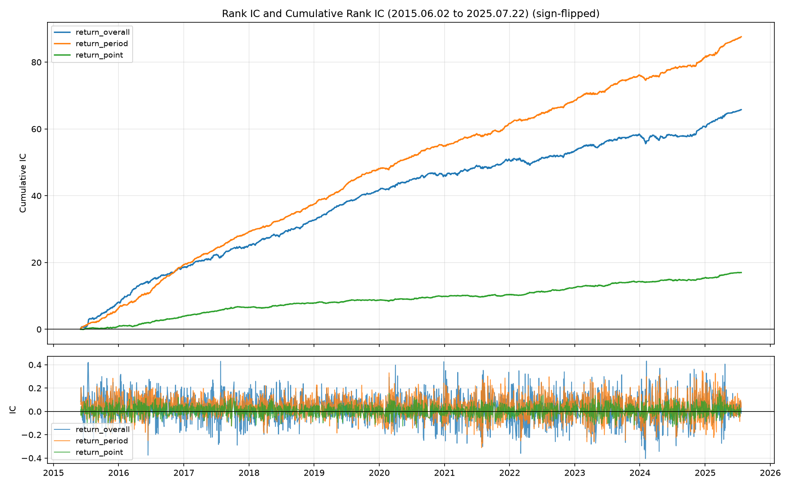

- 三者整体趋势相似，累积 IC 的排序分别为：时间段 > 整体 > 时间点；
- overall 和 point 几乎不相关（Pearson 约 0.06）；period_top20 与另外两个都呈中等正相关（Pearson 约 0.5）；
- 时间段因子同时包含了整体因子与时间点因子的信息，在信息与噪声之间取得了较好的平衡，效果最好。

### 时间点局部因子：价格-高点-振幅因子

假设股票价格序列为

$$
p_{i,d,t},
$$

表示股票 $i$ 在第 $d$ 天第 $t$ 个分频时点的价格（取 `close`）。以分频股票数据为例，价格-高点-振幅因子的具体计算方法为：

1. 对价格序列做滚动平均，窗口为 `window`，得到平滑价格。价格只取日内的价格。

2. 对每只股票，在每天内取平滑价格的最大值对应的时点，记为

$$
t^{\ast}=\arg\max_t \bar p_{i,d,t}.
$$

3. 对于长度分别为 $L,R$ 的左右窗口，对区间

$$
[t^{\ast} - L, t^{\ast} + R]
$$

内的每根 K 线振幅求平均（等权），其中振幅定义为

$$
a_{i,d,t}=\frac{\mathrm{high}_{i,d,t}-\mathrm{low}_{i,d,t}}{\mathrm{close}_{i,d,t}}.
$$

若窗口位于开盘/收盘附近，例如 $t^{\ast} - L \lt 1$，则将区间左端点取为开盘时点，右端点同理。

4. 计算结果在每日横截面内做标准化。

### 时间点区间因子：成交量-前低后低-平均收益率因子

假设股票价格序列为

$$
p_{i,d,t},
$$

表示股票 $i$ 在第 $d$ 天第 $t$ 个分频时点的价格（取 `close`）。以分频股票数据为例，成交量-前低后低-平均收益率因子的具体计算方法为：

1. 对成交量序列做滚动平均，窗口为 `window`，得到平滑成交量。成交量只取日内的数值。

2. 对每只股票，在每天内取平滑成交量的最大值对应的时点，记为

$$
t^{\ast}=\arg\max_t \bar v_{i,d,t}.
$$

3. 分别在 $t^{\ast}$ 之前与之后的区间内取最小值点，记为

$$
t^{-}=\arg\min_{t\lt t^{\ast}}\bar v_{i,d,t}, \qquad
t^{+}=\arg\min_{t\gt t^{\ast}}\bar v_{i,d,t}.
$$

4. 在区间 $[t^{-}, t^{+}]$ 内，计算对数收益率的平均值：

$$
f_{i,d}=\frac{1}{t^{+} - t^{-} + 1}\sum_{t=t^{-}}^{t^{+}}
\left(\log p_{i,d,t}-\log p_{i,d,t-1}\right).
$$

5. 计算结果在每日横截面内做标准化。

### 时间点特点因子：成交量-高点个数因子

假设股票成交量序列为

$$
v_{i,d,t},
$$

表示股票 $i$ 在第 $d$ 天第 $t$ 个分频时点的成交量。以分频股票数据为例，成交量-高点个数因子的具体计算方法为：

1. 对成交量序列做滚动平均，窗口为 `window`，得到平滑成交量。成交量只取日内的数值。

2. 对平滑后的成交量序列，计算每只股票在每日内的平均值与标准差。

3. 对每只股票，统计日内满足两个条件的时点个数：平滑成交量为局部极大值，且不低于日内平滑成交量均值加一倍标准差。记满足局部极大值条件的时点集合为 $\mathcal{M}_{i,d}$，则

$$
N_{i,d}=\sum_t \mathbf{1}\left\lbrace
\left(t\in\mathcal{M}_{i,d}\right)
\land
\bar v_{i,d,t}\geq \mathrm{mean}(\bar v_{i,d,\cdot})+\mathrm{std}(\bar v_{i,d,\cdot})
\right\rbrace.
$$

4. 计算结果在每日横截面内做标准化。

## 第二章 回测结果（ret_w=1）

以下每个因子均展示净值曲线、年度收益图和完整年度指标表。图表后的评述基于对应 CSV 表格中的全样本与分年度指标。

### 收益率-整体因子

过去 20 个交易日所有分频数据的对数收益率求和，并在日内横截面上做标准化。

| 净值曲线 | 年度收益 |
| --- | --- |
| 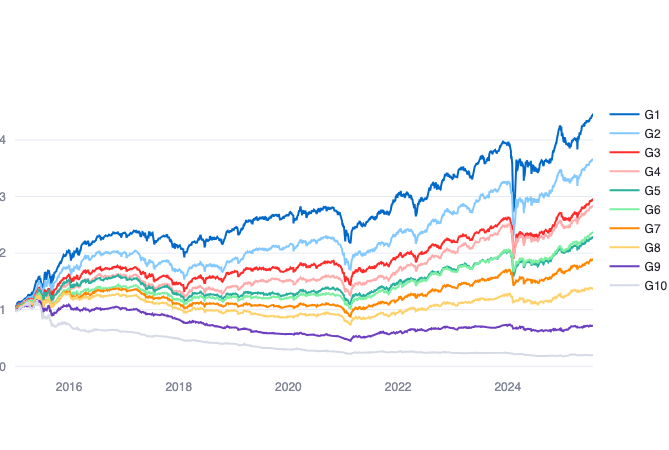 | 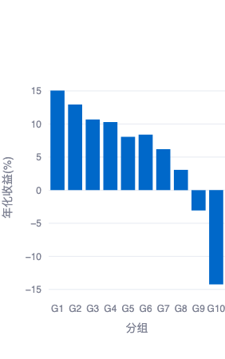 |

- 净值曲线评述：全样本多头年化收益为 16.92%，多头最大回撤为 -54.55%，收益路径仍受到阶段性回撤约束。
- 年度收益图评述：多头超额收益最高年份为 2015 年（138.89%），最低年份为 2017 年（-10.2%）；多头年化收益最高年份为 2015 年（169.11%），最低年份为 2018 年（-19.95%）。

| year | RankIC(%) | RankICIR | 多头超额收益(%) | 多头信息比 | 多头超额最大回撤(%) | 空头超额收益(%) | 空头信息比 | 空头超额最大回撤(%) | 多头年化收益(%) | 多头年化波动率(%) | 多头最大回撤(%) |
| --- | --- | --- | --- | --- | --- | --- | --- | --- | --- | --- | --- |
| all | -2.55 | -0.85 | 15.3 | 1.07 | -30.98 | 14.48 | 0.93 | -22.53 | 16.92 | 34.59 | -54.55 |
| 2025 | -2.35 | -0.75 | 9.7 | 1.12 | -6.17 | -12.02 | -1.19 | -18.13 | 27.31 | 27.36 | -18.2 |
| 2024 | -2.26 | -0.56 | 4.67 | 0.27 | -30.97 | 28.56 | 1.9 | -10.02 | 15.62 | 45.05 | -39.06 |
| 2023 | -1.91 | -0.7 | 16.8 | 2.22 | -6.37 | 1.77 | 0.14 | -7.53 | 8.73 | 17.61 | -10.61 |
| 2022 | -1.28 | -0.41 | 7.07 | 0.77 | -14.13 | 5.62 | 0.44 | -9.53 | -12.93 | 26.03 | -37.24 |
| 2021 | -2.02 | -0.65 | 24.96 | 1.59 | -12.52 | -4.77 | -0.37 | -22.53 | 32.04 | 19.5 | -11.37 |
| 2020 | -1.85 | -0.66 | -8.44 | -0.56 | -12.55 | 20.66 | 1.36 | -9.15 | 14.97 | 29.7 | -20.6 |
| 2019 | -3.18 | -1.63 | 13.14 | 1.16 | -5.79 | 34.05 | 3.94 | -6.77 | 43.09 | 23.59 | -16.61 |
| 2018 | -2.42 | -0.92 | 9.63 | 1.3 | -9.98 | 12.56 | 2.52 | -4.89 | -19.95 | 27.13 | -34.25 |
| 2017 | -2.22 | -0.69 | -10.2 | -0.78 | -12.87 | 22.7 | 4 | -4.3 | -8.09 | 20.26 | -16.1 |
| 2016 | -3.32 | -1.29 | 12.71 | 1.53 | -8.2 | 13.23 | 1.45 | -7.36 | -2.92 | 37.65 | -33.72 |
| 2015 | -5.11 | -1.55 | 138.89 | 4.09 | -22.27 | 34.2 | 0.5 | -18.22 | 169.11 | 69.36 | -54.55 |

- 表格评述：全样本 RankIC 为 -2.55%，RankICIR 为 -0.85，多头超额收益为 15.3%，多头信息比为 1.07，多头超额最大回撤为 -30.98%。整体收益率因子在新口径下多头端表现较好，但 RankIC 为负，使用时需要确认排序方向。

### 收益率-时间段因子

过去 20 个交易日中，提取每日分频下每笔成交量在前 20% 的数据，对其对数收益率求和，并在日内横截面上做标准化。

| 净值曲线 | 年度收益 |
| --- | --- |
| 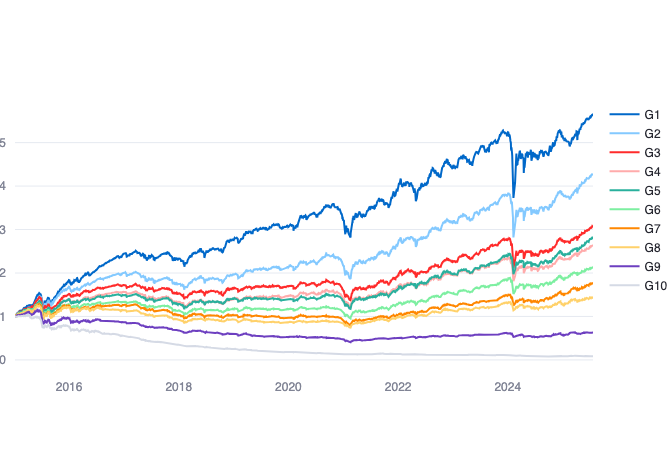 | 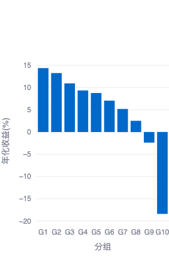 |

- 净值曲线评述：全样本多头年化收益为 19.43%，多头最大回撤为 -53.75%，收益路径仍受到阶段性回撤约束。
- 年度收益图评述：多头超额收益最高年份为 2015 年（109.16%），最低年份为 2017 年（-5.02%）；多头年化收益最高年份为 2015 年（143.27%），最低年份为 2018 年（-16.27%）。

| year | RankIC(%) | RankICIR | 多头超额收益(%) | 多头信息比 | 多头超额最大回撤(%) | 空头超额收益(%) | 空头信息比 | 空头超额最大回撤(%) | 多头年化收益(%) | 多头年化波动率(%) | 多头最大回撤(%) |
| --- | --- | --- | --- | --- | --- | --- | --- | --- | --- | --- | --- |
| all | -3.08 | -1.33 | 17.97 | 1.43 | -28.92 | 21 | 1.39 | -23.58 | 19.43 | 32.11 | -53.75 |
| 2025 | -3.53 | -0.97 | 10.88 | 1.7 | -4.5 | -4.75 | -0.52 | -18.63 | 29.71 | 23.25 | -15.44 |
| 2024 | -2.64 | -0.87 | -1.04 | 0.09 | -28.38 | 28.69 | 1.51 | -15.52 | 9.97 | 45.25 | -37.49 |
| 2023 | -3.01 | -1.25 | 16.08 | 2.29 | -5.37 | 6.02 | 0.44 | -10.08 | 8.01 | 16.95 | -10.62 |
| 2022 | -2.31 | -1.04 | 9.19 | 1 | -12.32 | 11.61 | 0.99 | -9.63 | -10.82 | 24.97 | -34.47 |
| 2021 | -2.71 | -1.04 | 24.87 | 1.55 | -12.57 | -2.34 | -0.29 | -23.58 | 31.96 | 17.4 | -10.57 |
| 2020 | -2.34 | -1.04 | 6.29 | 0.57 | -10.77 | 30.46 | 2.08 | -9.83 | 29.49 | 27.23 | -18.27 |
| 2019 | -3.46 | -2.02 | 13.88 | 1.35 | -4.4 | 38.76 | 3.47 | -10.15 | 43.82 | 22.25 | -15.74 |
| 2018 | -2.97 | -1.7 | 13.34 | 1.92 | -8.14 | 19.45 | 3.66 | -5.13 | -16.27 | 25.31 | -31.69 |
| 2017 | -2.95 | -1.7 | -5.02 | -0.47 | -8.91 | 38.01 | 5.39 | -3.57 | -2.99 | 17.94 | -16.93 |
| 2016 | -4.25 | -2.14 | 27.84 | 3.92 | -6.05 | 23.29 | 2.05 | -6.89 | 11.85 | 35.47 | -32.16 |
| 2015 | -3.93 | -1.89 | 109.16 | 4.29 | -19.75 | 29.95 | 0.55 | -16.4 | 143.27 | 62.82 | -53.75 |

- 表格评述：全样本 RankIC 为 -3.08%，RankICIR 为 -1.33，多头超额收益为 17.97%，多头信息比为 1.43，多头超额最大回撤为 -28.92%。该因子兼具整体收益与高成交强度片段的信息，全样本多头收益与信息比在收益率类因子中较突出。

### 收益率-时间点因子

过去 20 个交易日中，提取每日分频下每笔成交量最大的时点，对该时点对数收益率求和，并在日内横截面上做标准化。

| 净值曲线 | 年度收益 |
| --- | --- |
| 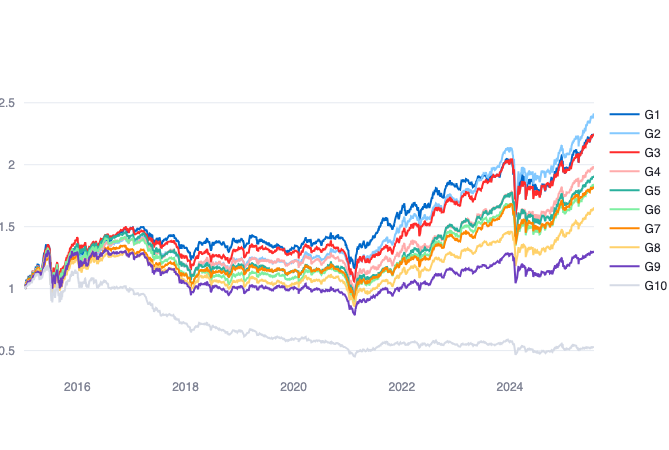 | 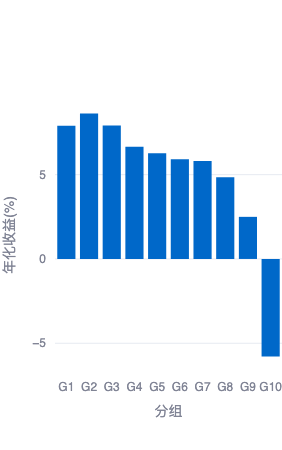 |

- 净值曲线评述：全样本多头年化收益为 9.49%，多头最大回撤为 -59.13%，收益路径仍受到阶段性回撤约束。
- 年度收益图评述：多头超额收益最高年份为 2015 年（45.95%），最低年份为 2017 年（-10.74%）；多头年化收益最高年份为 2015 年（78.19%），最低年份为 2018 年（-26.77%）。

| year | RankIC(%) | RankICIR | 多头超额收益(%) | 多头信息比 | 多头超额最大回撤(%) | 空头超额收益(%) | 空头信息比 | 空头超额最大回撤(%) | 多头年化收益(%) | 多头年化波动率(%) | 多头最大回撤(%) |
| --- | --- | --- | --- | --- | --- | --- | --- | --- | --- | --- | --- |
| all | -0.63 | -0.71 | 8.03 | 0.75 | -22.57 | 5.87 | 0.2 | -28.95 | 9.49 | 32.36 | -59.13 |
| 2025 | -1.13 | -1.27 | 15.41 | 2.02 | -4.85 | -3.45 | -0.52 | -9.23 | 39.11 | 25.37 | -17.89 |
| 2024 | -0.47 | -0.47 | -2.48 | 0.02 | -22.34 | 10.85 | 0.32 | -19.09 | 8.54 | 42.97 | -33.44 |
| 2023 | -0.68 | -0.84 | 9.31 | 1.46 | -3.49 | -3.38 | -0.51 | -10.15 | 1.3 | 16.7 | -15.6 |
| 2022 | -0.58 | -0.75 | 9.01 | 1.07 | -8.5 | 1.49 | 0.02 | -10.25 | -11 | 24.13 | -31.35 |
| 2021 | -0.58 | -0.63 | 26.65 | 1.85 | -11.42 | -10.44 | -0.83 | -21.94 | 33.7 | 18.58 | -10.5 |
| 2020 | -0.57 | -0.61 | -0.51 | 0.03 | -9.6 | 16.23 | 1.24 | -7.48 | 22.78 | 29.43 | -18.74 |
| 2019 | -0.33 | -0.47 | -6.38 | -0.56 | -9.65 | 14 | 1.21 | -9.64 | 23.98 | 23.23 | -22.1 |
| 2018 | -0.57 | -0.75 | 2.74 | 0.47 | -7.91 | 6.03 | 0.73 | -10.91 | -26.77 | 25.89 | -35.57 |
| 2017 | -0.74 | -0.95 | -10.74 | -1.18 | -11.65 | 28.46 | 3.91 | -3.83 | -8.62 | 17.91 | -18.05 |
| 2016 | -1 | -0.92 | 8.5 | 1.26 | -7.84 | 10.39 | 0.67 | -9.21 | -7.25 | 36.92 | -34.48 |
| 2015 | -0.53 | -0.47 | 45.95 | 2.04 | -20.87 | -17.92 | -0.98 | -28.95 | 78.19 | 63.07 | -57.82 |

- 表格评述：全样本 RankIC 为 -0.63%，RankICIR 为 -0.71，多头超额收益为 8.03%，多头信息比为 0.75，多头超额最大回撤为 -22.57%。该因子的 RankIC 幅度较弱，多头端仍有正超额，但稳定性弱于整体与时间段收益率因子。

### 价格-高点-振幅因子

对日内价格做 5 分频滚动平滑，定位平滑价格高点，并计算高点左右各 5 个分频区间内振幅的平均值。

| 净值曲线 | 年度收益 |
| --- | --- |
| 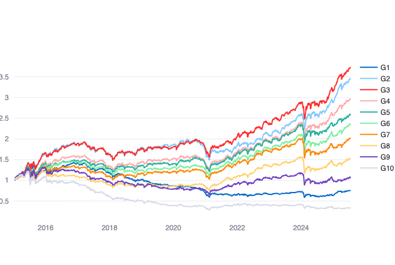 | 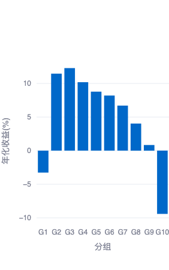 |

- 净值曲线评述：全样本多头年化收益为 -1.03%，多头最大回撤为 -79.21%，收益路径仍受到阶段性回撤约束。
- 年度收益图评述：多头超额收益最高年份为 2015 年（34.76%），最低年份为 2020 年（-24.35%）；多头年化收益最高年份为 2015 年（66.5%），最低年份为 2018 年（-39.17%）。

| year | RankIC(%) | RankICIR | 多头超额收益(%) | 多头信息比 | 多头超额最大回撤(%) | 空头超额收益(%) | 空头信息比 | 空头超额最大回撤(%) | 多头年化收益(%) | 多头年化波动率(%) | 多头最大回撤(%) |
| --- | --- | --- | --- | --- | --- | --- | --- | --- | --- | --- | --- |
| all | -3.14 | -1.55 | -2.65 | -0.14 | -59.88 | 9.95 | 0.34 | -37.52 | -1.03 | 30.5 | -79.21 |
| 2025 | -5.33 | -1.88 | 20.16 | 3.4 | -3.95 | 1.03 | -0.1 | -8.81 | 49.29 | 21.08 | -16.98 |
| 2024 | -3.51 | -1.6 | -13.16 | -0.64 | -19.72 | 19.49 | 0.56 | -17.63 | -2.05 | 38.66 | -31.34 |
| 2023 | -3.34 | -2.36 | 8.34 | 1.45 | -4.33 | -2.56 | -0.38 | -9.42 | 0.35 | 14.77 | -13.85 |
| 2022 | -2.21 | -1.23 | 0.49 | 0.07 | -10.23 | 3.44 | 0.13 | -11.14 | -19.46 | 21.89 | -32.49 |
| 2021 | -1.74 | -0.82 | -5.86 | -0.54 | -13.76 | -20.62 | -1.07 | -33.15 | 1.67 | 14.57 | -12.04 |
| 2020 | -2.63 | -1.28 | -24.35 | -2.39 | -21.01 | 11.35 | 0.46 | -11.54 | -0.73 | 26.27 | -19.35 |
| 2019 | -3.63 | -1.98 | -19.96 | -2.27 | -16.34 | 31.49 | 2.42 | -11.81 | 10.66 | 20.54 | -22.18 |
| 2018 | -2.9 | -1.53 | -9.75 | -1.44 | -17.64 | 12.35 | 1.4 | -9.98 | -39.17 | 23.01 | -44.52 |
| 2017 | -3.26 | -1.89 | -17.03 | -1.99 | -17.39 | 34.59 | 3.97 | -4.69 | -14.82 | 16.65 | -19.58 |
| 2016 | -4.17 | -2.19 | 10.3 | 1.69 | -5.62 | 13.18 | 0.94 | -6.46 | -5.29 | 34.48 | -33.17 |
| 2015 | -2.79 | -1.11 | 34.76 | 1.37 | -17.57 | -12.98 | -0.81 | -29.28 | 66.5 | 63.78 | -54.7 |

- 表格评述：全样本 RankIC 为 -3.14%，RankICIR 为 -1.55，多头超额收益为 -2.65%，多头信息比为 -0.14，多头超额最大回撤为 -59.88%。该因子全样本 RankIC 为负，但多头端收益不占优，说明信号方向和组合构造仍需进一步检查。

### 成交量-前低后低-平均收益率因子

对日内成交量做 5 分频滚动平滑，定位成交量高点前后的低量点，并计算两低点之间对数收益率的平均值。

| 净值曲线 | 年度收益 |
| --- | --- |
| 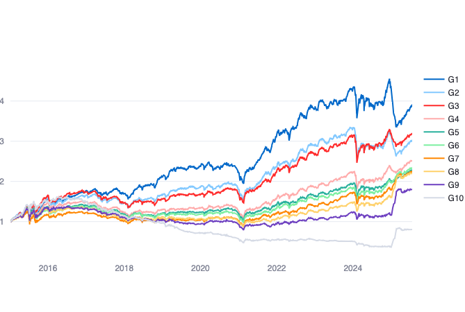 | 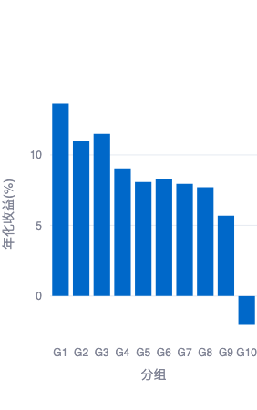 |

- 净值曲线评述：全样本多头年化收益为 15.48%，多头最大回撤为 -56.27%，收益路径仍受到阶段性回撤约束。
- 年度收益图评述：多头超额收益最高年份为 2015 年（76.38%），最低年份为 2025 年（-10.17%）；多头年化收益最高年份为 2015 年（107.57%），最低年份为 2018 年（-12.54%）。

| year | RankIC(%) | RankICIR | 多头超额收益(%) | 多头信息比 | 多头超额最大回撤(%) | 空头超额收益(%) | 空头信息比 | 空头超额最大回撤(%) | 多头年化收益(%) | 多头年化波动率(%) | 多头最大回撤(%) |
| --- | --- | --- | --- | --- | --- | --- | --- | --- | --- | --- | --- |
| all | -2.17 | -1.1 | 13.87 | 1.11 | -26.41 | 2.07 | -0.09 | -58.02 | 15.48 | 33.34 | -56.27 |
| 2025 | 4.59 | 0.93 | -10.17 | -1.05 | -22.88 | -124.34 | -3.52 | -57.98 | -10.07 | 25.83 | -30.69 |
| 2024 | -2.02 | -1.29 | 1.63 | 0.2 | -17.6 | 30.67 | 1.6 | -12.27 | 12.61 | 40.25 | -29.96 |
| 2023 | -1.67 | -1.45 | 11.58 | 1.7 | -5.86 | 4.46 | 0.67 | -4.1 | 3.56 | 16.62 | -16.84 |
| 2022 | -2.12 | -1.52 | 15.89 | 1.74 | -8.88 | 2.77 | 0.19 | -11.75 | -4.17 | 24.95 | -31.63 |
| 2021 | -3.48 | -2.61 | 45.89 | 3.22 | -12.59 | 3.4 | 0.19 | -15.76 | 52.62 | 18.4 | -11.25 |
| 2020 | -1.77 | -1.13 | -7.83 | -0.58 | -11.14 | 25.02 | 2.23 | -6.81 | 15.58 | 29.61 | -19.56 |
| 2019 | -3.14 | -2.43 | 16.08 | 1.51 | -5.37 | 34.33 | 3.89 | -5.71 | 45.96 | 23.63 | -17.99 |
| 2018 | -2.89 | -1.73 | 17.11 | 2.3 | -9.1 | 11.08 | 1.82 | -7.43 | -12.54 | 27.14 | -32.1 |
| 2017 | -2.83 | -1.73 | -3.51 | -0.3 | -9.28 | 23.77 | 3.24 | -4.33 | -1.5 | 18.58 | -17.55 |
| 2016 | -2.76 | -1.53 | 9.68 | 1.25 | -10.73 | 1.11 | -0.19 | -13.28 | -5.9 | 38.11 | -36.3 |
| 2015 | -2.7 | -1.22 | 76.38 | 2.59 | -23.8 | -68.55 | -1.58 | -45.69 | 107.57 | 67.43 | -56.27 |

- 表格评述：全样本 RankIC 为 -2.17%，RankICIR 为 -1.1，多头超额收益为 13.87%，多头信息比为 1.11，多头超额最大回撤为 -26.41%。该因子全样本多头超额较好，但 2025 年表现明显承压，需要关注近期样本稳定性。

### 成交量-高点个数因子

对日内成交量做 5 分频滚动平滑，统计满足局部极大且不低于日内均值加一倍标准差的高点个数。

| 净值曲线 | 年度收益 |
| --- | --- |
| 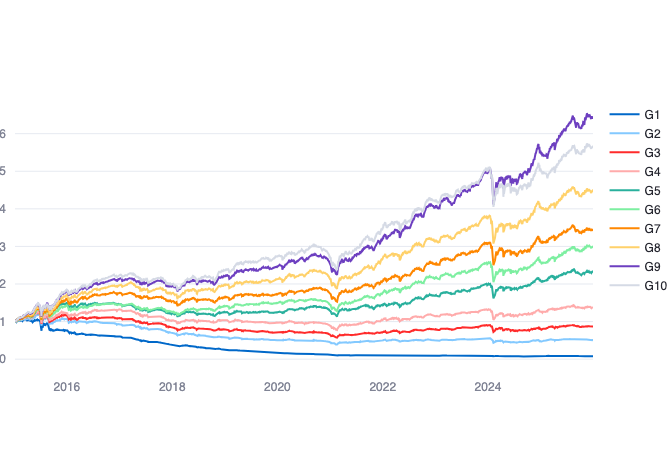 | 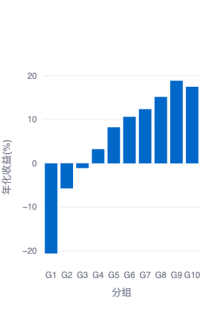 |

- 净值曲线评述：全样本多头年化收益为 19.37%，多头最大回撤为 -53.4%，收益路径仍受到阶段性回撤约束。
- 年度收益图评述：多头超额收益最高年份为 2015 年（112.9%），最低年份为 2017 年（-11%）；多头年化收益最高年份为 2015 年（143.54%），最低年份为 2018 年（-16.9%）。

| year | RankIC(%) | RankICIR | 多头超额收益(%) | 多头信息比 | 多头超额最大回撤(%) | 空头超额收益(%) | 空头信息比 | 空头超额最大回撤(%) | 多头年化收益(%) | 多头年化波动率(%) | 多头最大回撤(%) |
| --- | --- | --- | --- | --- | --- | --- | --- | --- | --- | --- | --- |
| all | 3.47 | 2.49 | 17.75 | 1.5 | -22.87 | 20.94 | 1.5 | -26.46 | 19.37 | 32.06 | -53.4 |
| 2025 | 2.07 | 0.95 | 11.04 | 1.72 | -4.51 | -18.87 | -1.75 | -19.35 | 30.02 | 23.11 | -15.32 |
| 2024 | 3.37 | 2.32 | 0.78 | 0.16 | -20.39 | 28.37 | 1.41 | -13.43 | 11.77 | 40.09 | -31.37 |
| 2023 | 2.94 | 3.04 | 17.92 | 2.94 | -2.85 | -1.02 | -0.21 | -8.57 | 9.85 | 15.36 | -10.81 |
| 2022 | 2.76 | 2.45 | 16.01 | 1.99 | -6.98 | 9.55 | 0.94 | -8.67 | -4.05 | 22.75 | -29.47 |
| 2021 | 2.92 | 2.72 | 31.41 | 2.22 | -12.41 | 5.04 | 0.25 | -18.03 | 38.39 | 16.11 | -10.87 |
| 2020 | 2.95 | 1.99 | -1.42 | -0.12 | -11.95 | 34.97 | 3.22 | -6.89 | 21.89 | 27.35 | -18.23 |
| 2019 | 4.61 | 3.42 | 20.88 | 2.16 | -4 | 51.06 | 6.1 | -5.48 | 50.65 | 22.17 | -16.46 |
| 2018 | 3.74 | 2.65 | 12.71 | 1.75 | -8.97 | 22.66 | 4.19 | -8.02 | -16.9 | 26.08 | -33.42 |
| 2017 | 3.57 | 2.82 | -11 | -1.23 | -13.78 | 36.65 | 5.58 | -3.28 | -8.88 | 17.44 | -18.12 |
| 2016 | 4.31 | 3.51 | 17.48 | 2.43 | -6.81 | 18.01 | 2.1 | -4.18 | 1.77 | 36.23 | -33.44 |
| 2015 | 4.29 | 2.47 | 112.9 | 3.94 | -21.11 | 30.96 | 0.38 | -26.46 | 143.54 | 66.3 | -53.4 |

- 表格评述：全样本 RankIC 为 3.47%，RankICIR 为 2.49，多头超额收益为 17.75%，多头信息比为 1.5，多头超额最大回撤为 -22.87%。该因子 RankIC 与 RankICIR 均为正，多头超额和信息比也较高，是本次结果中相对更稳定的信号之一。

### 多头相对走势汇总

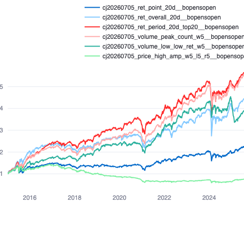

- 图片评述：全市场口径用于比较 6 个因子多头组合在同一回测窗口内的相对强弱，适合观察整体排序与阶段性分化。

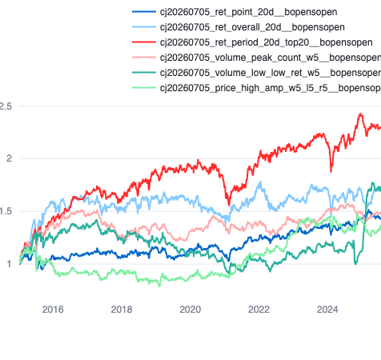

- 图片评述：沪深300口径更偏大盘样本，可用于检验因子在大市值股票池中的适配度与稳定性。

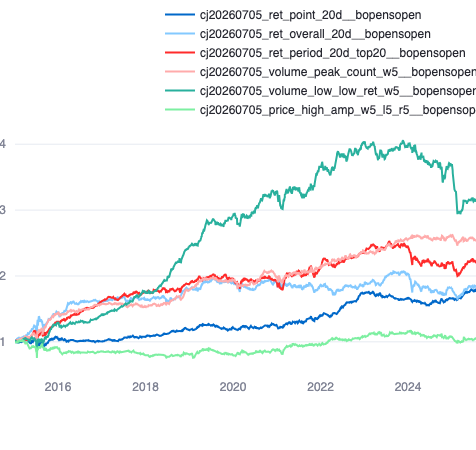

- 图片评述：中证500口径反映中盘股票池中的多头相对表现，便于和沪深300、中证1000结果做风格对照。

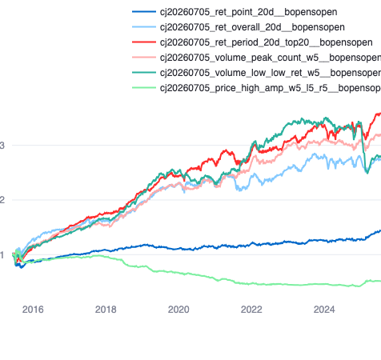

- 图片评述：中证1000口径更偏小盘样本，有助于观察高频形态因子在小盘股票池中的收益弹性与回撤特征。
