# 研报复现：《长江证券20260705》

完整标题：*高频因子（二十）：收益来源基础的因子挖掘方法论三——时间点划分因子*

## 数据说明

样本：全市场分频数据 `dfs://data_m-stock_m`

时间窗口：20150105-20260703

六个因子在数据库上的变量名为：
- 收益率-整体：`cj20260705_ret_overall_20d`
- 收益率-时间段：`cj20260705_ret_period_20d_top20`
- 收益率-时间点：`cj20260705_ret_point_20d`
- 价格-高点-振幅：`cj20260705_price_high_amp_w5_l5_r5`
- 成交量-前低后低-平均收益率：`cj20260705_volume_low_low_ret_w5`
- 成交量-高点个数：`cj20260705_volume_peak_count_w5`

## 第一章 因子定义

### 收益率类因子

三种时间跨度下的收益率因子分别定义为：

- 收益率-整体：过去 20 个交易日所有数据的对数收益率求和，计算结果在日内横截面上做标准化；
- 收益率-时间段：过去 20 个交易日中，提取每日分频下每笔成交量（`volume / num_trades`）在前 20% 的数据，该数据的对数收益率求和，计算结果在日内横截面上做标准化；
- 收益率-时间点：过去 20 个交易日中，提取每日分频率下每笔成交量最大的数据，该数据的对数收益率求和，计算结果在日内横截面上做标准化。

下图报告了三个因子在 20150105-20250722 窗口内的累积 RankIC：

- 三者整体趋势相似，累积 IC 的排序分别为：时间段 > 整体 > 时间点；
- overall 和 point 几乎不相关（Pearson 约 0.06）；period_top20 与另外两个都呈中等正相关（Pearson 约 0.5）；
- 时间段因子同时包含了整体因子与时间点因子的信息，在信息与噪声之间取得了较好的平衡，效果最好。

### 时间点局部因子：价格-高点-振幅因子

假设股票价格序列为

$$
p_{i,d,t},
$$

表示股票 $i$ 在第 $d$ 天第 $t$ 个分频时点的价格（取 `close`）。以分频股票数据为例，价格-高点-振幅因子的具体计算方法为：

1. 对价格序列做滚动平均，窗口为 `window`，得到平滑价格。价格只取日内的价格。

2. 对每只股票，在每天内取平滑价格的最大值对应的时点，记为

$$
t^{\ast}=\arg\max_t \bar p_{i,d,t}.
$$

3. 对于长度分别为 $L,R$ 的左右窗口，对区间

$$
[t^{\ast} - L, t^{\ast} + R]
$$

内的每根 K 线振幅求平均（等权），其中振幅定义为

$$
a_{i,d,t}=\frac{\mathrm{high}_{i,d,t}-\mathrm{low}_{i,d,t}}{\mathrm{close}_{i,d,t}}.
$$

若窗口位于开盘/收盘附近，例如 $t^{\ast} - L \lt 1$，则将区间左端点取为开盘时点，右端点同理。

4. 计算结果在每日横截面内做标准化。

### 时间点区间因子：成交量-前低后低-平均收益率因子

假设股票价格序列为

$$
p_{i,d,t},
$$

表示股票 $i$ 在第 $d$ 天第 $t$ 个分频时点的价格（取 `close`）。以分频股票数据为例，成交量-前低后低-平均收益率因子的具体计算方法为：

1. 对成交量序列做滚动平均，窗口为 `window`，得到平滑成交量。成交量只取日内的数值。

2. 对每只股票，在每天内取平滑成交量的最大值对应的时点，记为

$$
t^{\ast}=\arg\max_t \bar v_{i,d,t}.
$$

3. 分别在 $t^{\ast}$ 之前与之后的区间内取最小值点，记为

$$
t^{-}=\arg\min_{t\lt t^{\ast}}\bar v_{i,d,t}, \qquad
t^{+}=\arg\min_{t\gt t^{\ast}}\bar v_{i,d,t}.
$$

4. 在区间 $[t^{-}, t^{+}]$ 内，计算对数收益率的平均值：

$$
f_{i,d}=\frac{1}{t^{+} - t^{-} + 1}\sum_{t=t^{-}}^{t^{+}}
\left(\log p_{i,d,t}-\log p_{i,d,t-1}\right).
$$

5. 计算结果在每日横截面内做标准化。

### 时间点特点因子：成交量-高点个数因子

假设股票成交量序列为

$$
v_{i,d,t},
$$

表示股票 $i$ 在第 $d$ 天第 $t$ 个分频时点的成交量。以分频股票数据为例，成交量-高点个数因子的具体计算方法为：

1. 对成交量序列做滚动平均，窗口为 `window`，得到平滑成交量。成交量只取日内的数值。

2. 对平滑后的成交量序列，计算每只股票在每日内的平均值与标准差。

3. 对每只股票，统计日内满足两个条件的时点个数：平滑成交量为局部极大值，且不低于日内平滑成交量均值加一倍标准差。记满足局部极大值条件的时点集合为 $\mathcal{M}_{i,d}$，则

$$
N_{i,d}=\sum_t \mathbf{1}\left\lbrace
\left(t\in\mathcal{M}_{i,d}\right)
\land
\bar v_{i,d,t}\geq \mathrm{mean}(\bar v_{i,d,\cdot})+\mathrm{std}(\bar v_{i,d,\cdot})
\right\rbrace.
$$

4. 计算结果在每日横截面内做标准化。

## 回测结果
以下分别展示了不同调仓周期下上述6个因子的回测结果，调仓周期分别为20个交易日与1个交易日。

所有因子均经过中性化处理。

### cj20260705_ret_overall_20d（ret_w=1）

#### 回测结果图

##### 分组年化收益

##### 分组净值曲线

- **分组收益表现**：分组年化收益从 G1 到 G10 基本递减，G1 为正收益最高、G10 明显为负，头尾分化清楚，单调性较好。
- **净值曲线表现**：净值曲线长期保持较清晰分层，G1 持续上行、G10 长期走弱；2020 年前后及 2024 年附近有回撤，但分层未被破坏。
- **统计指标表现**：summary_table 的 all 行 RankIC 为 -2.48%，RankICIR 为 -1.25；多头超额收益 17.13%，信息比 1.35，但多头最大回撤达到 -53.14%。
- **整体判断**：该因子在日频调仓下方向明确、分层稳定，具备较好的截面区分能力，但组合回撤偏大。

### cj20260705_ret_overall_20d（ret_w=20）

#### 回测结果图

##### 分组年化收益

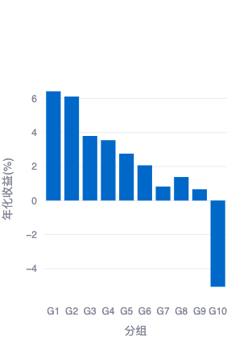

##### 分组净值曲线

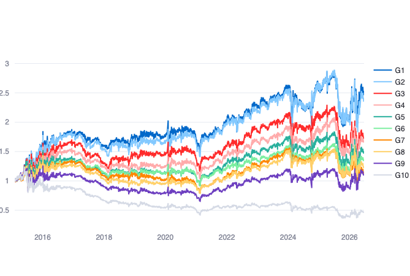

- **分组收益表现**：G1、G2 收益较高，G10 为负，头尾差仍然明显；但中间组并非严格单调，G8 略高于邻近组。
- **净值曲线表现**：2015-2023 年大体维持分层，2024 年以后波动显著放大，多个组别回撤和交叉增多，稳定性弱于日频调仓。
- **统计指标表现**：all 行 RankIC 为 -3.86%，RankICIR 为 -1.89；多头超额收益 6.80%，多头信息比仅 0.03，多头最大回撤 -51.39%。
- **整体判断**：20 日调仓下仍有方向性，但收益转化效率和曲线稳定性明显下降，更适合作为辅助信号。

### cj20260705_ret_period_20d_top20（ret_w=1）

#### 回测结果图

##### 分组年化收益

##### 分组净值曲线

- **分组收益表现**：分组年化收益从 G1 到 G10 呈较明显递减，G1、G2 收益较高，G10 大幅为负，头尾分化充分。
- **净值曲线表现**：净值曲线长期分层清晰，G1 与 G2 位于上方，G10 持续落后；2020 年前后有阶段性回撤，但之后恢复较快。
- **统计指标表现**：all 行 RankIC 为 -2.70%，RankICIR 为 -1.68；多头超额收益 14.76%，信息比 1.41，多头最大回撤 -52.80%。
- **整体判断**：日频调仓下该因子单调性和长期稳定性较好，统计指标也支持其有效性，但仍需关注较大的净值回撤。

### cj20260705_ret_period_20d_top20（ret_w=20）

#### 回测结果图

##### 分组年化收益

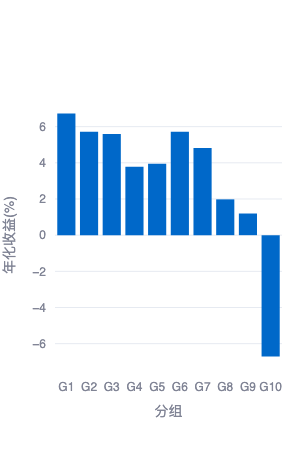

##### 分组净值曲线

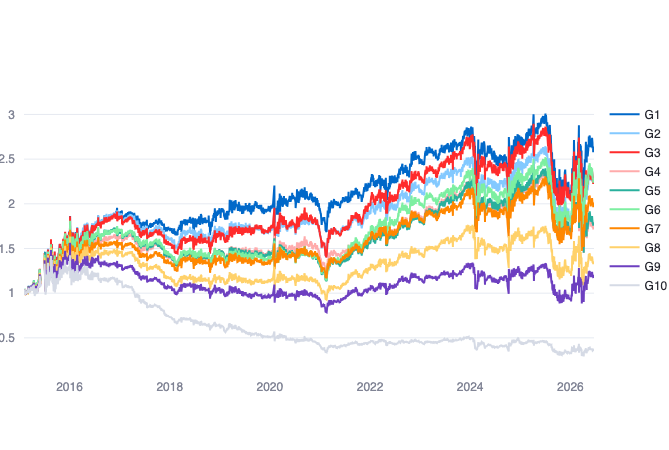

- **分组收益表现**：G1 到 G3 以及 G6、G7 收益较高，G10 显著为负，头尾分化存在，但中间组排序不够单调。
- **净值曲线表现**：长期看 G10 明显落后，优势组整体在上方；但 2024 年后曲线波动加剧，组间交叉增多，存在阶段性失效迹象。
- **统计指标表现**：all 行 RankIC 为 -5.27%，RankICIR 为 -3.35；多头超额收益 7.13%，多头信息比 0.01，多头最大回撤 -40.20%。
- **整体判断**：20 日调仓保留了头尾分化，但收益分布不平滑，组合层面的收益效率较弱。

### cj20260705_ret_point_20d（ret_w=1）

#### 回测结果图

##### 分组年化收益

##### 分组净值曲线

- **分组收益表现**：G1-G3 收益较高，G10 为负，头尾有分化；但 G2、G3 高于 G1，G8 也偏高，整体单调性一般。
- **净值曲线表现**：G10 长期处于下方，说明尾部识别较稳定；优势组之间交叉较多，2018-2020 年曲线阶段性走平，稳定性弱于整体和时间段因子。
- **统计指标表现**：all 行 RankIC 为 -0.50%，RankICIR 为 -0.77；多头超额收益 7.19%，信息比 0.72，多头最大回撤 -58.54%。
- **整体判断**：该因子有一定头尾区分能力，但 IC 与单调性均偏弱，更适合与其他收益率类因子组合使用。

### cj20260705_ret_point_20d（ret_w=20）

#### 回测结果图

##### 分组年化收益

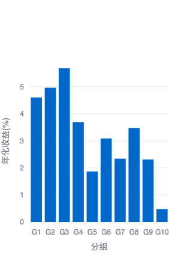

##### 分组净值曲线

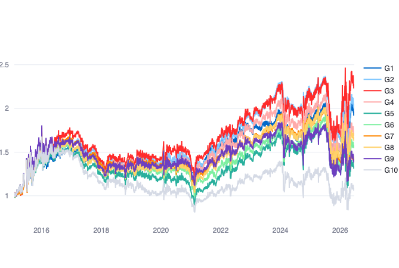

- **分组收益表现**：G10 收益最低，G1-G4 相对较高，但中间组起伏明显，G8 高于相邻组，单调性较弱。
- **净值曲线表现**：净值曲线分层不稳定，多个组别长期交叉；2024 年后波动和回撤加大，优势组并未持续稳定占优。
- **统计指标表现**：all 行 RankIC 为 -1.15%，RankICIR 为 -1.96；多头超额收益 4.87%，多头信息比 -0.05，多头最大回撤 -51.39%。
- **整体判断**：20 日调仓下信号较弱，虽有头尾差异，但稳定性和收益转化都不足，单独使用价值有限。

### cj20260705_price_high_amp_w5_l5_r5（ret_w=1）

#### 回测结果图

##### 分组年化收益

##### 分组净值曲线

- **分组收益表现**：G2、G3 收益最高，G10 明显为负，尾部识别较强；但 G1 也为负，整体并非从 G1 到 G10 单调递减。
- **净值曲线表现**：G3、G2 等中间偏低编号组长期位于上方，G10 持续落后，分化较明显；G1 表现偏弱，说明极端组存在反转或噪声。
- **统计指标表现**：all 行 RankIC 为 -3.13%，RankICIR 为 -1.54；多头超额收益 -3.36%，多头信息比 -0.21，多头最大回撤 -79.21%。
- **整体判断**：该因子有尾部区分能力，但最优收益不在 G1，直接按单边多头使用风险较高。

### cj20260705_price_high_amp_w5_l5_r5（ret_w=20）

#### 回测结果图

##### 分组年化收益

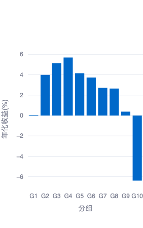

##### 分组净值曲线

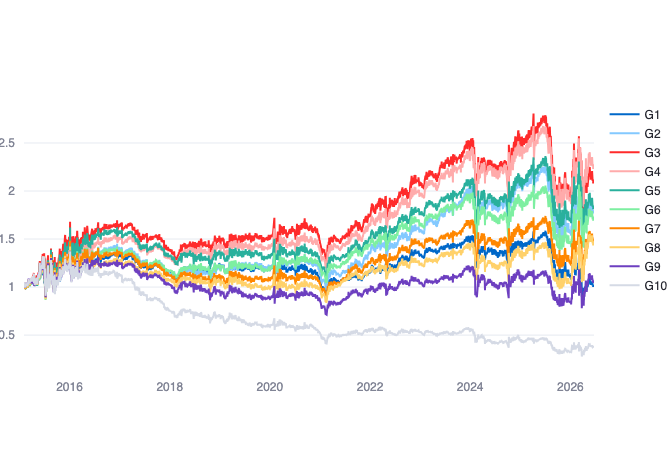

- **分组收益表现**：G4 附近收益最高，G10 为负，头尾有分化；但 G1 接近零，收益排序呈驼峰形，单调性不足。
- **净值曲线表现**：中间组长期占优，G10 长期处于底部；2024 年后波动明显放大，优势组回撤较深，曲线稳定性一般。
- **统计指标表现**：all 行 RankIC 为 -5.06%，RankICIR 为 -2.80；多头超额收益仅 0.06%，多头信息比 -0.14，多头最大回撤 -60.22%。
- **整体判断**：20 日调仓下统计 IC 较强但组合收益转化有限，分组结构不支持简单单调配置。

### cj20260705_volume_low_low_ret_w5（ret_w=1）

#### 回测结果图

##### 分组年化收益

##### 分组净值曲线

- **分组收益表现**：G1 收益最高，G10 为负，头尾分化明显；中间组整体随编号递减，但 G3、G6 等位置有小幅扰动。
- **净值曲线表现**：G1 长期领先，G10 长期落后，分层较清楚；2024 年后 G1 回撤较大，但随后有所修复，阶段波动需要关注。
- **统计指标表现**：all 行 RankIC 为 -2.21%，RankICIR 为 -1.14；多头超额收益 13.80%，信息比 1.11，多头最大回撤 -56.27%。
- **整体判断**：日频调仓下该因子具备较好的头尾识别能力，长期有效性尚可，但极端年份和回撤压力不小。

### cj20260705_volume_low_low_ret_w5（ret_w=20）

#### 回测结果图

##### 分组年化收益

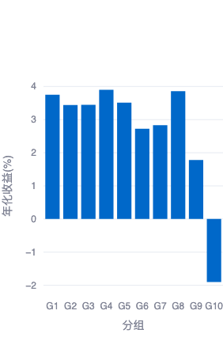

##### 分组净值曲线

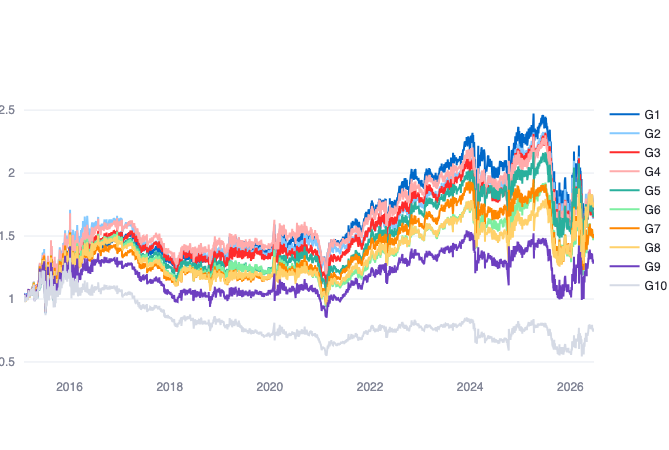

- **分组收益表现**：G10 明显为负，其余组大多为正，但 G1-G8 之间排序不平滑，头尾分化主要来自最差组。
- **净值曲线表现**：G10 长期落后较稳定，其他组别之间交叉较多；2024 年后整体波动加大，优势组相对位置不够稳定。
- **统计指标表现**：all 行 RankIC 为 -2.60%，RankICIR 为 -2.06；多头超额收益 3.98%，多头信息比 -0.04，多头最大回撤 -58.69%。
- **整体判断**：20 日调仓下因子更多体现为尾部剔除能力，多头收益贡献和单调性均较弱。

### cj20260705_volume_peak_count_w5（ret_w=1）

#### 回测结果图

##### 分组年化收益

##### 分组净值曲线

- **分组收益表现**：分组年化收益随组别编号整体上升，G1 显著为负，G9、G10 收益最高，头尾分化非常明显，单调性较好。
- **净值曲线表现**：G9、G10 长期处于上方，G1 持续下行，净值分层稳定；2020 年和 2024 年附近有回撤，但未改变长期排序。
- **统计指标表现**：all 行 RankIC 为 3.48%，RankICIR 为 2.50；多头超额收益 17.30%，信息比 1.45，多头最大回撤 -53.40%。
- **整体判断**：这是日频调仓下表现较强的因子，方向、分层和统计指标一致，但仍需控制组合回撤。

### cj20260705_volume_peak_count_w5（ret_w=20）

#### 回测结果图

##### 分组年化收益

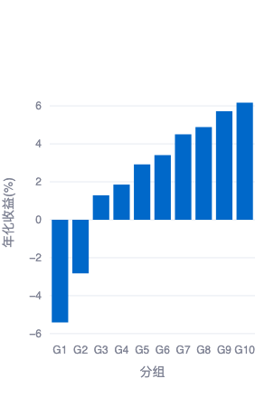

##### 分组净值曲线

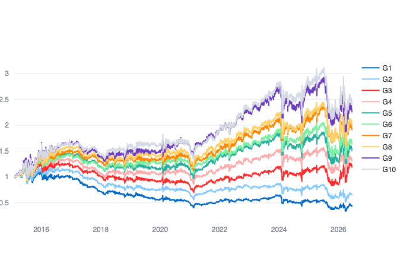

- **分组收益表现**：年化收益从 G1 到 G10 大体递增，G1、G2 为负，G10 最高，头尾分化明显且单调性较好。
- **净值曲线表现**：G9、G10 长期位于上方，G1 持续落后，分层较稳定；但 2024 年后高收益组回撤和波动加大，短期稳定性下降。
- **统计指标表现**：all 行 RankIC 为 5.29%，RankICIR 为 4.30；多头超额收益 6.54%，多头信息比 0.03，多头最大回撤 -52.56%。
- **整体判断**：20 日调仓下因子排序能力仍强，但多头超额收益效率不高，适合用于排序或组合约束中的增强信号。
